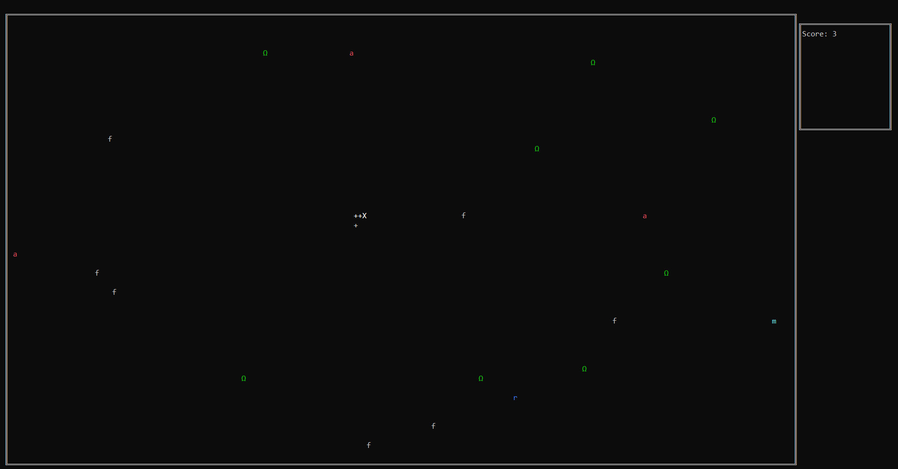

# snake_console
A C# console application that represents a snake game with some advanced features.
It is also possible to view the previous scores (serialization file).

## Used technologies
 

## Features
* **a**: Represents an apple. The snake is enlarged by one segment if it eats an apple.
* **Ω**: Represents a segment killer. The snake is shortened by one segment if it eats the segment killer.
* **f**: Represents a speed killer. The snake slows down if it eats a speed killer.
* **m**: Represents a speed enhancer. The snake speeds up if it eats a speed enhancer.
* **r**: Represents a rainbow mushroom. The snake changes the color of its segments randomly if it eats a rainbow mushroom.

## When it's over
If the snake bites itself or bumps into the playfield border, the game is over.

